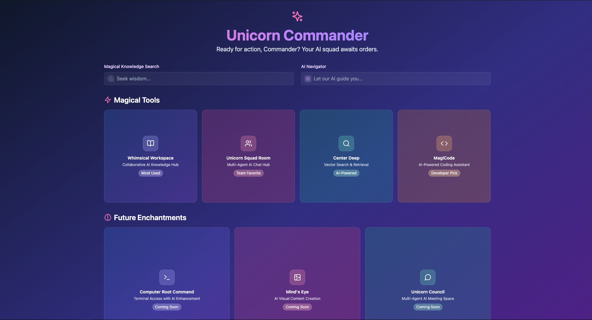

# 🦄 Unicorn Commander Dashboard



A cutting-edge interface for managing AI-powered tools and services, featuring:
- ✨ Modern glassmorphism design
- 🌈 Dynamic gradient backgrounds
- 🔍 Integrated search interfaces
- 🃏 Interactive application cards
- 🚀 Coming soon features section

## 🛠️ Installation
```bash
git clone https://github.com/your-username/unicorn-commander-dashboard.git
cd unicorn-commander-dashboard
npm install
```

## 🚀 Usage
```bash
npm run dev
```
Open http://localhost:5173 in your browser

## 🌈 Features
- **Responsive Design**: Works on all screen sizes
- **Modern UI**: Glassmorphism effects with Tailwind CSS
- **Dynamic Gradients**: Each card has unique color scheme
- **Interactive Elements**: Hover effects and smooth transitions

## 🧰 Tech Stack
- ⚛️ React 18
- 🎨 Tailwind CSS
- ⚡ Vite
- ✨ Lucide Icons

## 📄 License
MIT License - see [LICENSE](LICENSE) for details

## 🙏 Acknowledgments
- [Lucide](https://lucide.dev/) for beautiful icons
- Tailwind Labs for amazing utility-first CSS framework
